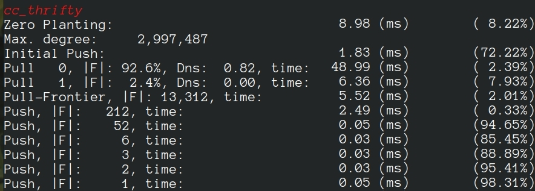
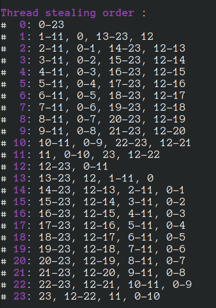

#  LaganLighter Docs: General Info

## Cloning

`git clone https://github.com/MohsenKoohi/LaganLighter.git --recursive`

## Graph Types
LaganLighter supports the following graph formats:
- CSR/CSC [WebGraph](https://law.di.unimi.it/datasets.php) format: supported by the [Poplar Graph Loading Library](https://blogs.qub.ac.uk/DIPSA/Poplar/)
- Textual CSR/CSC for small graphs (testing). This format has 4 lines: 
  1. Number of vertices (|V|), 
  2. Number of edges (|E|), 
  3. |V| space-separated numbers showing offsets of the vertices, 
  4. |E| space-separated numbers indicating edges.
   

## Measurements
In addition to execution time, we use the [PAPI](http://icl.cs.utk.edu/papi/) library to measure hardware counters such as L3 cache misses, hardware instructions, DTLB misses, and load and store memory instructions. ( `papi_(init/start/reset/stop)` and `(print/reset)_hw_events` functions defined in [omp.c](https://github.com/MohsenKoohi/LaganLighter/blob/main/omp.c) ).

To measure load balance, we measure the total time of executing a loop and the time each thread spends in this loop (`mt` and `ttimes` in the following sample code). Using these values, PTIP macro (defined in [omp.c](https://github.com/MohsenKoohi/LaganLighter/blob/main/omp.c) ) calculates the percentage of average idle time (as an indicator of load imbalance) and prints it with the total time (`mt`).
```
    mt = - get_nano_time()
    #pragma omp parallel  
    {
       unsigned tid = omp_get_thread_num();
       ttimes[tid] = - get_nano_time();
    	
       #pragma omp for nowait
       for(unsigned int v = 0; v < g->vertices_count; v++)
       {
          // .....
       }
       ttimes[tid] += get_nano_time();
    }
    mt += get_nano_time();
    PTIP("Step ... ");
 ```   

As an example, the following execution of [Thrifty](https://blogs.qub.ac.uk/DIPSA/Thrifty), shows that the “Zero Planting” step has been performed in 8.98 milliseconds and with a 8.22% load imbalance, while processors have been idle for 72.22% of the execution time, on average, in the “Initial Push” step.



## NUMA-Aware and Locality-Preserving Partitioning and Scheduling

In order to assign consecutive partitions (vertices and/or their edges) to each parallel processor, we initially divide partitions and assign a number of consecutive partitions to each thread. Then, we specify the order of victim threads in the work-stealing process. During the initialization of LaganLighter parallel processing environment (in `**initialize_omp_par_env**()` function defined in file omp.c), for each thread, we create a list of threads as consequent victims of stealing.

A thread, first, steals jobs (i.e., partitions) from consequent threads in the same NUMA node and then from the threads in consequent NUMA nodes. As an example, the following image shows the stealing order of a 24-core machine with 2 NUMA nodes. This shows that thread 1 steals from threads 2, 3, …,11, and ,0 running on the same NUMA socket and then from threads 13, 14, …, 23, and 12 running on the next NUMA socket.



We use `**dynamic_partitioning_...()**` functions (in file partitioning.c) to process partitions by threads in the specified order. A sample code is in the following:

```
    struct dynamic_partitioning* dp = dynamic_partitioning_initialize(pe, partitions_count);
    
    #pragma omp parallel  
    {
       unsigned int tid = omp_get_thread_num();
       unsigned int partition = -1U;		
    
       while(1)
       {
          partition = dynamic_partitioning_get_next_partition(dp, tid, partition);
          if(partition == -1U)
    	 break; 
    
          for(v = start_vertex[partition]; v < start_vertex[partition + 1]; v++)
          {
    	// ....
           }
       }
    }
    
    dynamic_partitioning_reset(dp);
```    


--------------------
