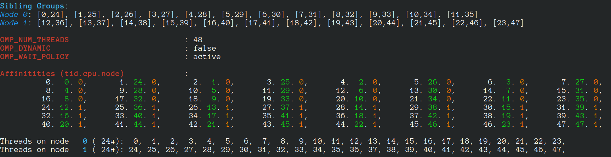
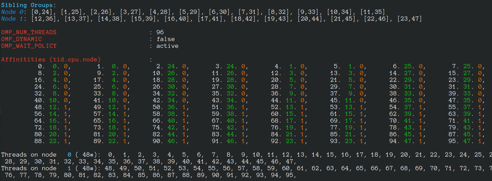

#  LaganLighter Docs: Thread Pinning (Setting Affinity)

In applications such as graph processing, it is important how threads are pinned on CPU cores as 
the threads that share resources (such as memory and cache) can accelerate the performance by 
processing consecutive blocks of input dataset, especially, when the dataset has a high-level of locality.

In LaganLighter, we read the CPU topology to specify how OpenMP threads are pinned. 
In [`omp.c`](https://github.com/MohsenKoohi/LaganLighter/blob/main/omp.c) file, 
the block starting with comment "`Reading sibling groups of each node`" 
reads the "`/sys/devices/system/cpu/cpu*/topology/thread_siblings`" files 
to identify the sibling threads and three arrays ("`node_sibling_groups_start_ID`", 
"`sibling_group_cpus_start_offsets`", and "`sibling_groups_cpus`") are used to store the sibling CPUs.

Then, in block starting with comment "`Setting affinity of threads`", 
the sibling groups are read and based on the total number of threads requested by user, 
a number of threads with consecutive IDs are pinned to sibling CPUs.

For a machine with 24 cores, 48 hyperthreads, when 48 threads are requested, we have:

If 96 threads are created, we have:

--------------------
