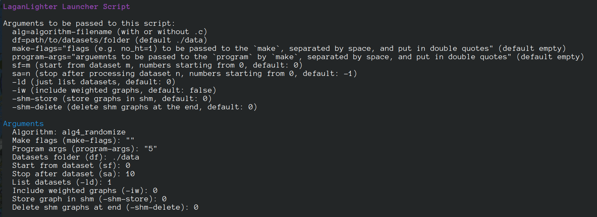
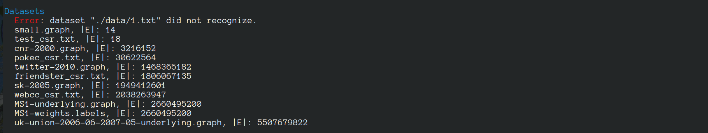
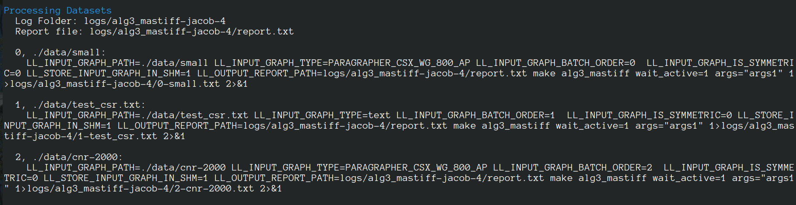
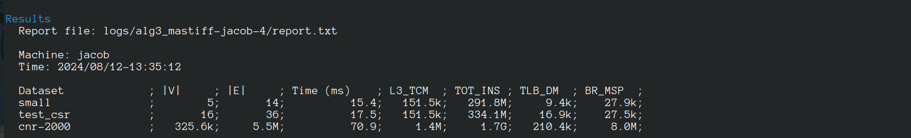

#  LaganLighter Docs: Launcher Script For Processing Multiple Datasets

To run an algorithm for multiple graphs and collecting their results,
the [launcher](../launcher.sh) script is used.

## Arguments

  - **alg**=algorithm-filename (with or without .c)`
  - **df**=path/to/datasets/folder (default ./data)
  - **make-flags**="flags (e.g. `threads=t`, `no_ht=1`, `debug=1`, `wait_passive=1`, and/or `energy=1`) to be passed to the `make`, separated by space, and  double quoted" (default empty)
  - **program-args**="arguemnts to be passed to the `program` by `make`, separated by space, and double quoted" (default empty)
  - **sf=m** (start from dataset m, default: 0, i.e., all datasets are processed)
  - **sa=n** (stop after processing dataset n, default: -1, i.e., all datasets are processed)
  - **-ld** (just list datasets, default: 0)
  - **-iw** (include weighted graphs, default: 0)
  - **-shm-store** (store graphs in shm, default: 0)
  - **-shm-delete** (delete shm graphs at the end, default: 0)

As the first step, the script reads the arguments.

## Datasets

Datasets should be stored in / linked from a folder that is passed to the script using the **df** argument.

After reading the arguments, the script lists the datasets and sorts them by number of edges in the ascending order.

## Processing

The script creates a `log folder` to store the output of running the algorithm for each dataset.
The script, also, creates a `report file` that contains the final results collected from each dataset. 
The path to `report file` is passed to the algorithm using [`LL_OUTPUT_REPORT_PATH`](0.2-loading.md).
Procesing may be stopped by the script if the **sa** argument has been set.

## Printing Results

The last step is to print the `report file`.

--------------------
