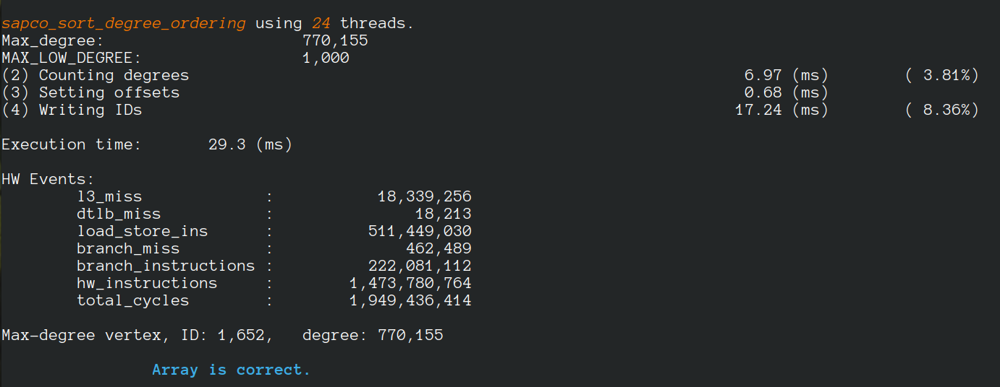

#  LaganLighter Docs: SAPCo Sort

[DOI:10.1109/ISPASS55109.2022.00015](https://doi.org/10.1109/ISPASS55109.2022.00015)

While counting sort has a better complexity than comparison-based sorting algorithms, 
its parallelization suffers from high performance overhead and/or has a memory complexity 
that depends on the numbers of threads and elements.

In this paper, we explore the optimization of parallel counting sort for degree-ordering of 
real-world graphs with skewed degree distribution and we introduce the Structure-Aware Parallel 
Counting (SAPCo) Sort algorithm that leverages the skewed degree distribution to accelerate sorting.

The evaluation for graphs of up to 3.6 billion vertices shows that SAPCo sort is, 
on average, 1.7-33.5 times faster than state-of-the-art sorting algorithms such as 
counting sort, radix sort, and sample sort.


### Bibtex
```
@INPROCEEDINGS{10.1109/ISPASS55109.2022.00015,
  author={Koohi Esfahani, Mohsen and Kilpatrick, Peter and Vandierendonck, Hans},
  booktitle={2022 IEEE International Symposium on Performance Analysis of Systems and Software (ISPASS)}, 
  title={{SAPCo Sort}: Optimizing Degree-Ordering for Power-Law Graphs}, 
  year={2022},
  volume={},
  number={},
  pages={},
  publisher={IEEE Computer Society},
  doi={10.1109/ISPASS55109.2022.00015}
}
```
### Source code
- [alg1_sapco_sort.c](../alg1_sapco_sort.c)
- [relabel.c](../relabel.c)

### Sample Exec

