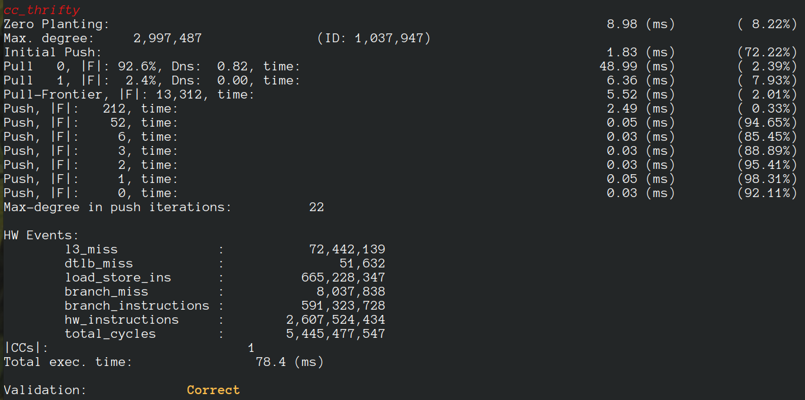

#  LaganLighter Docs: Thrifty Label Propagation Connected Components

[DOI: 10.1109/Cluster48925.2021.00042](https://doi.org/10.1109/Cluster48925.2021.00042)

Thrifty introduces four optimization techniques to Label Propagation Connected Components:

 1. Unified Labels Array accelerates label propagation by allowing the latest label of each vertex to be read in processing other vertices.
 2. Zero Convergence optimizes work-efficiency in the pull iterations of Label Propagation by skipping converged vertices.
 3. Zero Planting selects the best start propagating point and increases the convergence rate and removes pull iterations that are required for the lowest label to reach the core of graph.
 4. Initial Push technique makes the first iteration work efficient by skipping processing edges of vertices that probability of convergence is very small.

Based on these optimizations, Thrifty provides 1.4✕ speedup to Afforest, 6.6✕ to Jayanti-Tarjan, 14.3✕ to BFS-CC, and 25.0✕ to Direction Optimizing Label Propagation. 

### Bibtex
```

Bibtex

@INPROCEEDINGS{10.1109/Cluster48925.2021.00042,
  author={Koohi Esfahani, Mohsen and Kilpatrick, Peter and Vandierendonck, Hans},
  booktitle={2021 IEEE International Conference on Cluster Computing (CLUSTER)}, 
  title={Thrifty Label Propagation: Fast Connected Components for Skewed-Degree Graphs}, 
  year={2021},
  volume={},
  number={},
  pages={226-237},
  publisher={IEEE Computer Society},
  doi={10.1109/Cluster48925.2021.00042}
}

```

### Source code
- [alg2_thrifty.c](../alg2_thrifty.c)
- [cc.c](../cc.c)


### Sample Execution


