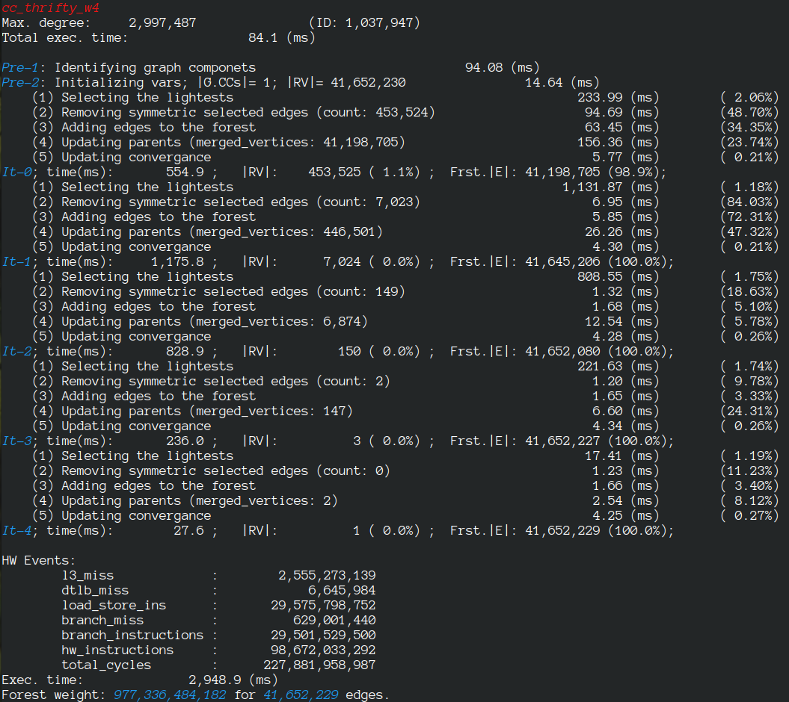

#  LaganLighter Docs: MASTIFF, Structure-Aware Minimum Spannig Forest/Tree

[DOI: 10.1145/3524059.3532365](https://doi.org/10.1145/3524059.3532365)

The Minimum Spanning Forest (MSF) problem finds usage in many different applications. While theoretical analysis shows that linear-time solutions exist, in practice, parallel MSF algorithms remain computationally demanding due to the continuously increasing size of data sets.

In this paper, we study the MSF algorithm from the perspective of graph structure and investigate the implications of the power-law degree distribution of real-world graphs
on this algorithm.

We introduce the MASTIFF algorithm as a structure-aware MSF algorithm that optimizes work efficiency by (1) dynamically tracking the largest forest component of each graph component and exempting them from processing, and (2) by avoiding topology-related operations such as relabeling and merging neighbour lists.

The evaluations on 2 different processor architectures with up to 128 cores and on graphs of up to 124 billion edges, shows that Mastiff is 3.4–5.9× faster than previous works.

### Bibtex
```

@INPROCEEDINGS{10.1145/3524059.3532365,
author = {Koohi Esfahani, Mohsen and Kilpatrick, Peter and Vandierendonck, Hans},
title = {{MASTIFF}: Structure-Aware Minimum Spanning Tree/Forest},
year = {2022},
isbn = {},
publisher = {Association for Computing Machinery},
address = {New York, NY, USA},
url = {https://doi.org/10.1145/3524059.3532365},
doi = {10.1145/3524059.3532365},
booktitle = {Proceedings of the 36th ACM International Conference on Supercomputing},
numpages = {13}
}

```

### Source code
- [alg3_mastiff.c](../alg3_mastiff.c)
- [msf.c](../msf.c)


### Sample Execution


