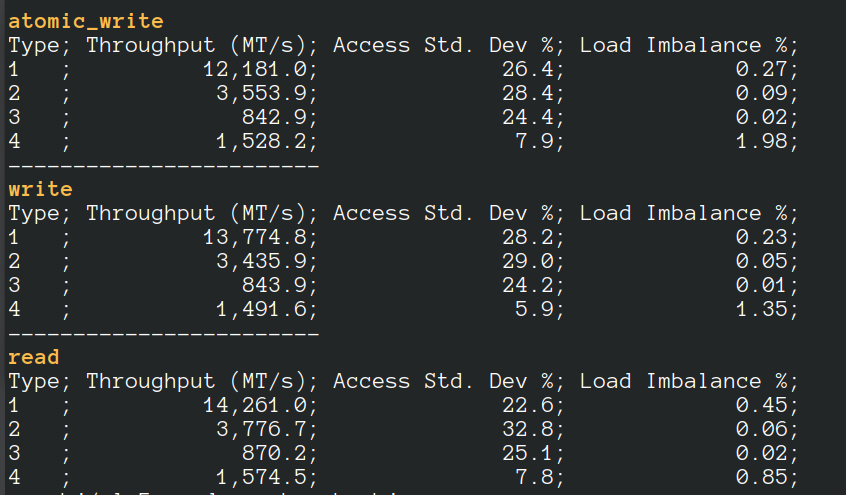

 

#  LaganLighter Docs: Random Memory Benchmark

The [alg5_rand_mem_bench.c](../alg5_rand_mem_bench.c) is a parallel memory benchmark
for random memory accesses in four domains:

- Domain 1: each core perfroms memory accesses to its local L3 cache,
- Domain 2: each core perfroms memory accesses to all L3 caches of its NUMA node,
- Domain 3: each core perfroms memory accesses to all L3 caches, and
- Domain 4: each core perfroms memory accesses which are missed by all L3 caches.

The code evaluates 3 types of memory accesses:

- Atomic write
- Write
- Read

To run the benchmark you need to run `make alg5_rand_mem_bench`.
To remove hyper threading, run `make alg5_rand_mem_bench no_ht=1`.

The results are shown as the Million Transactions per second (MT/s).
A sample output is shown in the following.

