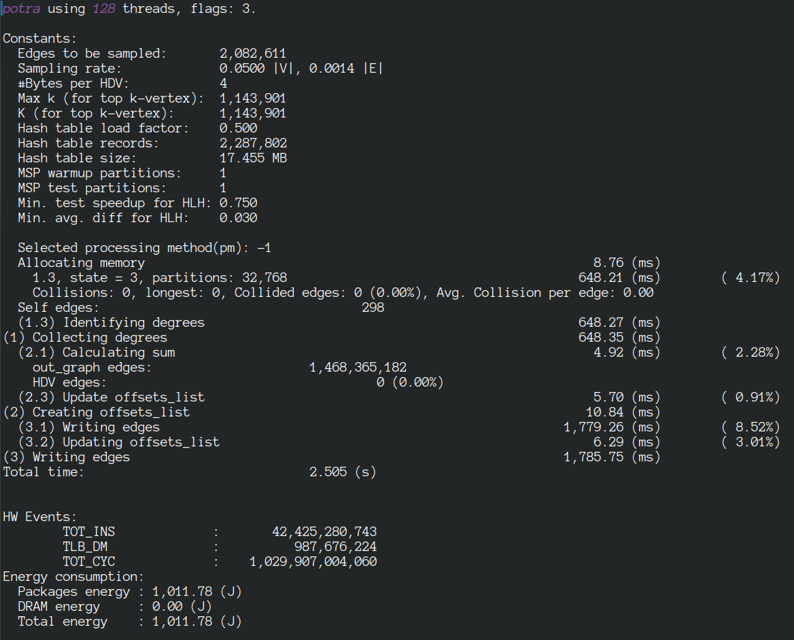

#  LaganLighter Docs: PoTra Graph Transposition

Graph Transposition (GT) is 
a fundamental graph algorithm that is widely used in graph analytics and scientific computing.

Previous GT algorithms have significant memory requirements that are proportional to the number of vertices and 
threads which obstructs their use on large graphs. Moreover, atomic memory operations have become comparably fast on 
recent CPU architectures, which creates new opportunities for improving the performance of concurrent atomic accesses in GT.

We design PoTra, a GT algorithm which leverages graph structure and processor and memory architecture to optimize locality 
and performance. PoTra limits the size of additional data structures close to CPU cache sizes and utilizes the skewed degree 
distribution of graph datasets to optimize locality and performance. We present the performance model of PoTra to explain the 
connection between cache and memory response times and graph locality.

Our evaluation of PoTra on three CPU architectures and 20 real-world and synthetic graph datasets with up to 128 billion edges 
demonstrates that PoTra achieves up to 8.7 times speedup compared to previous works and if there is a performance loss 
it remains limited to 15.7%, on average. 

For more details please refer to [PoTra paper](https://arxiv.org/abs/2501.06872).

### Source code
The source code is available on [alg6_potra.c](../alg6_potra.c) and [trans.c](../trans.c).

### Bibtex

```
@misc{PoTra,
		title={On Optimizing Locality of Graph Transposition on Modern Architectures}, 
		author={Mohsen {Koohi Esfahani} and Hans Vandierendonck},
		year={2025},
		eprint={2501.06872},
		archivePrefix={arXiv},
		primaryClass={cs.DC},
		url={https://arxiv.org/abs/2501.06872},
		doi={10.48550/arXiv.2501.06872} 
	} 
```

### Sample Execution

A sample output is shown in the following.



